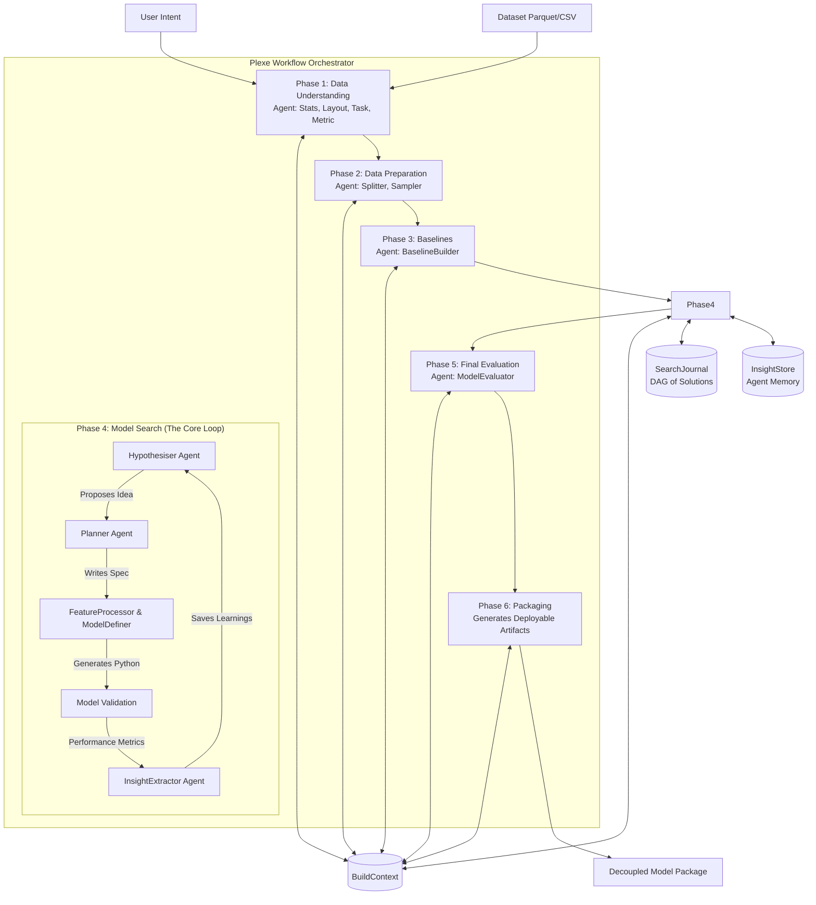

# Plexe AI: Internal Architecture Overview

Plexe AI is an agentic framework designed to construct Machine Learning models autonomously from natural language intents and tabular datasets. At its core, it relies on a strict, sequential phase orchestration driven by 14 specialized LLM agents.

This document breaks down the core structural components that make Plexe work.

## 1. The Blackboard Pattern: `BuildContext`

Plexe does **not** rely on complex agent-to-agent messaging protocols (like AutoGen or ChatDev). Instead, it uses a **Blackboard Architecture**. 

The central state is managed by a single dataclass called `BuildContext` (located in `plexe/models.py`). 

### How it works:
- **Central Truth**: `BuildContext` is passed sequentially to every phase and every agent. It holds all the critical data: the dataset URI, the identified machine learning task type (e.g., `BINARY_CLASSIFICATION`), the target columns, the generated metric code, the baseline performance, and a generic `scratch` dictionary for agents to pass ad-hoc intermediate data.
- **Fault Tolerance**: Because the entire state of the workflow is centralized in this one object, Plexe can serialize it into a JSON dictionary and save it to disk after every phase. If the system crashes in Phase 4, it simply deserializes the `BuildContext` from the last checkpoint and resumes without repeating Phase 1-3.

## 2. The Solution DAG: `SearchJournal`

During Phase 4 (Model Search), Plexe explores hundreds of model and feature engineering variations. To keep track of this, it uses a `SearchJournal`.

### How it works:
- **Tree Structure**: The `SearchJournal` is a Directed Acyclic Graph (DAG) that stores `Solution` objects.
- **Node Tracking**: Every time the system mutates an existing model (e.g., taking an XGBoost model and adding a log-transform feature), the new `Solution` is added as a "child" of the parent solution.
- **State per Node**: Each `Solution` node tracks:
  - The generated `sklearn` feature pipeline.
  - The model architecture (untrained).
  - The execution results (validation performance, training time, errors).
  - Its lineage (parent node and child nodes).
- **History and Context**: The journal allows agents to ask questions like *"What is the best model we've found so far?"* or *"Have we tried changing the learning rate on the CatBoost branch yet?"*.

## 3. Agent Orchestration (`workflow.py`)

Plexe defines a strict, 6-phase sequential orchestrator. Agents **do not** decide when to run. They are treated as sophisticated functions called by `workflow.py`.

### The 6 Phases:
1. **Data Understanding**: `LayoutDetectionAgent` and `StatisticalAnalyserAgent` profile the data. `MLTaskAnalyserAgent` determines the task. `MetricSelectorAgent` picks the evaluation metric.
2. **Data Preparation**: `DatasetSplitterAgent` and `SamplingAgent` downsample the data (e.g., 30k rows) to ensure the following search loop runs in seconds rather than hours.
3. **Baselines**: `BaselineBuilderAgent` builds a heuristic fallback model to establish a performance floor.
4. **Model Search (Core Loop)**: A hypothesis-driven iterative loop utilizing `HypothesiserAgent`, `PlannerAgent`, `FeatureProcessorAgent`, `ModelDefinerAgent`, and `InsightExtractorAgent`. (See *Tree Search Deep Dive* for details).
5. **Final Evaluation**: `ModelEvaluatorAgent` runs the best model against the full held-out test set to produce a final grading report (Core Metrics, Diagnostics, Robustness).
6. **Packaging**: The framework wraps the best model into a fully independent, deployable artifact directory (no Plexe dependency).