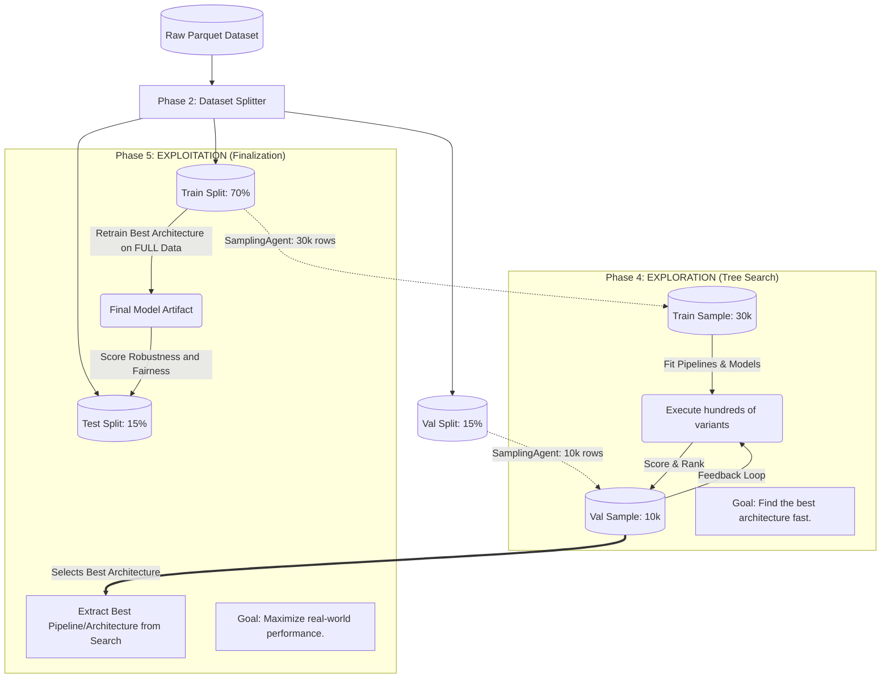

# Plexe AI: Data Flow and Sampling Deep Dive

To execute hundreds of model and feature combinations rapidly without timing out, Plexe relies heavily on dataset splitting and intelligent downsampling. This document maps out exactly how data flows through the system, how sampling is performed, and how "Exploration" vs "Exploitation" maps to different datasets.

## 1. The Data Splitting Architecture

In Phase 2 (`plexe/agents/dataset_splitter.py`), the original massive dataset is split into three primary partitions.

### Splitting Strategies:
- **Time-Series / Forecasting**: Uses a **Chronological Split**. It sorts by the time column and cuts the data (Train=Oldest, Test=Newest). This simulates production and strictly prevents future data leakage.
- **Classification**: Uses a **Stratified Split**. It ensures that the distribution of target classes (e.g., 90% False / 10% True) remains identical across Train, Validation, and Test sets.
- **Regression / Random**: Uses a standard random split (`df.randomSplit()` with a fixed seed).

By default, the ratios are:
- **Train Split (70%)**: The base data used for learning.
- **Val Split (15%)**: The data used to score models during the fast iterative search.
- **Test Split (15%)**: Strictly held out. The search algorithm never sees this data. It is only touched at the very end.

## 2. Intelligent Downsampling (The "30k" number)

After the three primary splits are created, running a 100-iteration tree search on 500GB of training data would take weeks. To solve this, Phase 2 generates **Samples** (`plexe/agents/sampler.py`). 

By default, it downsamples the Train split to `30,000` rows and the Val split to `10,000` rows.

### How Downsampling is Generated:
The `SamplingAgent` writes custom PySpark code to generate these samples, applying strict mathematical guardrails to prevent downstream pipeline crashes:

1. **Target Class Coverage (Classification)**: The sampler must use stratified sampling (`df.sampleBy`). For extremely rare classes (<1%), it is instructed to oversample to guarantee at least 10 samples per rare class. If a class is missing from the sample, the downstream classifier's `.fit()` method will crash.
2. **Categorical Coverage (Encoder Safety)**: The sampler inspects all categorical string columns. If a column has fewer than 1000 distinct categories, the agent uses a union approach to guarantee that *every single unique category* is present in the 30k sample. If a category is missing, a downstream `OneHotEncoder` fitted on the sample will throw an unknown category error when applied to the full dataset later.
3. **Missing Value Inclusion (Imputer Safety)**: The sampler checks if a column has nulls. If it does, the sample *must* include nulls. If it doesn't, a downstream `SimpleImputer` will not learn a strategy during the search phase, causing it to crash when later applied to the full dataset.

## 3. Data Flow Diagram: Exploration vs. Exploitation

The way Plexe uses these 5 datasets (Train, Val, Test, Train_Sample, Val_Sample) clearly delineates its **Exploration** (Search) phase from its **Exploitation** (Finalizing) phase.

### Summary of Data Lifecycle
1. **To Train (Search)**: `Train_Sample` (30k rows) is used exclusively.
2. **To Score (Search)**: `Val_Sample` (10k rows) is used to score every hypothesis. This drives the Simulated Annealing logic.
3. **To Retrain (Final)**: The full `Train Split` (70%) is used exactly once, to retrain the winning architecture on all available data.
4. **To Evaluate (Final)**: The full `Test Split` (15%) is strictly held out until Phase 5. It is used exactly once to generate the final Deployment Report (verdict, diagnostics, robustness). It is never used to pick models.
