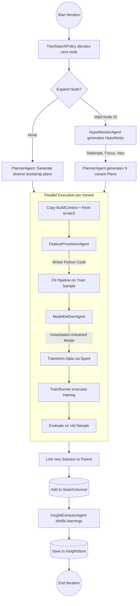

# Plexe AI: Tree Search Deep Dive

Plexe's core innovation lies in Phase 4: Model Search (`plexe/workflow.py`). It uses a hypothesis-driven iterative tree search to discover the best combination of feature engineering and model hyperparameters.

## 1. The Tree Search Policy

The search does not happen randomly. It is guided by a specific policy (`TreeSearchPolicy` in `plexe/search/tree_policy.py`) which dictates *which* node in the `SearchJournal` should be expanded next.

The policy operates in a three-stage, AIDE-inspired approach:

1. **Bootstrap (Draft)**: If the search tree has fewer than `num_drafts` root nodes, it tells the orchestrator to start from scratch. The system will generate completely diverse, new ideas rather than building on previous ones.
2. **Debug (Probabilistic)**: If a model run throws a Python error (a "buggy" node), the policy will probabilistically select it to be debugged by the LLM agents. To prevent infinite loops of trying to fix unfixable code, it caps this at `max_debug_depth`.
3. **Improve (Simulated Annealing)**: If there are successful solutions, the policy decides which one to mutate next to improve performance. It uses an **exploration-to-exploitation annealing** strategy. 
   - Early in the search (`temp` is high), it uses Softmax sampling to probabilistically select even sub-optimal solutions to ensure broad exploration.
   - As the search nears its maximum iterations (`temp` drops below 0.35), it becomes greedy, ruthlessly exploiting only the absolute best-performing solution in the journal.

## 2. The Search Control Flow

When the policy selects a node to expand, the orchestrator executes a multi-agent loop. Because running this loop sequentially is too slow, Plexe generates multiple variants and executes them in parallel threads.

Here is the exact control flow of a single search iteration:

## 3. The Execution Machinery

Inside the Parallel Execution phase (`_execute_variant` in `workflow.py`), you can see exactly how Plexe converts LLM suggestions into real machine learning models.

1. **Isolation**: Because multiple variants run simultaneously via `ThreadPoolExecutor`, a shallow copy of the `BuildContext` is created for each variant, with a fresh `scratch` dictionary to prevent race conditions.
2. **Feature Engineering**: The `FeatureProcessorAgent` generates an `sklearn` Pipeline in raw Python code. Plexe then executes this code dynamically, fits the pipeline on the training sample, and inspects the output schema dynamically.
3. **Model Generation**: The `ModelDefinerAgent` looks at the transformed schema and generates an untrained model (e.g., `XGBClassifier` or a Keras `Sequential` model).
4. **Training and Evaluation**: A `TrainingRunner` takes the fitted pipeline and the untrained model, runs the data through it, and calculates the final metric. The results are packaged into a new `Solution` node and added to the DAG.

## 4. Why This Architecture Was Chosen

This architecture balances the creativity of LLMs with the safety of deterministic code execution:
- **Agents don't execute code directly**: They output code or JSON plans, which the orchestrator strictly validates and executes. If an agent crashes or writes bad code, the orchestrator catches the exception, flags the `Solution` node as "buggy", and moves on.
- **Speed**: By running the search loop strictly on downsampled datasets (SAMPLES) and using multi-threading for variant evaluation, the system can evaluate dozens of hypotheses in the time it takes to train one full dataset model. The final chosen model is only retrained on the full dataset in Phase 5.
